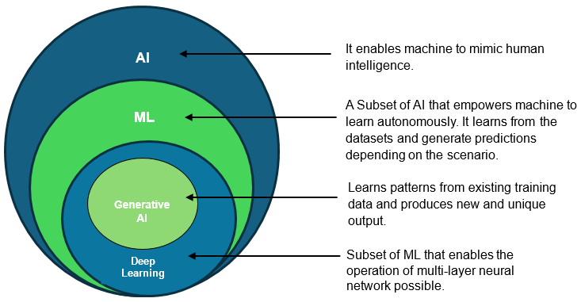

# TOPICS LEARNING AND UNDERSTANDING
* Most of these below topics are already present in notes of modules.
* For interview : learn from below websites
    * https://www.stackoverflowtips.com/posts/top-50-genai-llm-interview-questions-answers-2025
    * https://www.datacamp.com/blog/genai-interview-questions
    * https://credmark.ai/practice/top-transformer-based-models-interview-questions-and-answers

* FOR BETTER NOTES LEARNING AND INTERVIEW(CHECK THIS)
    * https://www.geeksforgeeks.org/artificial-intelligence/generative-ai-interview-question-with-answer/

## A. AI, ML, DL
Artificial Intelligence (AI) is the broad field of building machines that can perform tasks that usually require human intelligence, such as reasoning, learning, and decision-making.

Machine Learning (ML) is a subset of AI that enables systems to learn patterns from data and improve their performance without being explicitly programmed for every task.

Deep Learning (DL) is a subset of ML that uses artificial neural networks with many layers to solve complex problems like image recognition, speech processing, and natural language understanding.

### In short
- AI = the broad concept of intelligent machines
- ML = teaching machines using data
- DL = using deep neural networks for complex learning tasks
* Check this below image for overall understanding where each of them lies



## B. Deep Learning (ANN, RNN, CNN etc)

Deep Learning is a branch of machine learning that uses artificial neural networks with many layers to learn complex patterns from large amounts of data. It is especially powerful for tasks such as image recognition, speech recognition, language understanding, and prediction.

### Main Types of Deep Learning Models
- ANN (Artificial Neural Network): A basic neural network used for general-purpose prediction and classification tasks.
- CNN (Convolutional Neural Network): Best for image and video data because it can detect patterns like edges, shapes, and textures.
- RNN (Recurrent Neural Network): Designed for sequential data such as text, time series, and speech.
- LSTM/GRU: Advanced forms of RNNs that are better at remembering long-term information.

### In short
- Deep Learning = learning from data using layered neural networks
- ANN = basic neural network
- CNN = best for images
- RNN = best for sequences


## C. Transformers, Gen AI, and LLMs
Transformers are a neural network architecture that became the foundation of modern AI language models. They use a mechanism called attention, which helps the model focus on the most relevant words or parts of input when processing information.

Generative AI (Gen AI) is a type of AI that can create new content such as text, images, code, music, or videos. It learns patterns from large datasets and then generates new outputs based on those patterns.

Large Language Models (LLMs) are powerful AI models trained on huge amounts of text data. They can understand prompts, answer questions, summarize content, translate languages, and generate human-like text.

### Short notes
- Transformers = the architecture behind most modern GenAI models
- Gen AI = AI that generates new content
- LLMs = large models trained on massive text data for language tasks
- Examples = ChatGPT, Gemini, Claude, Llama


## D. Transformers vs RNN
Transformers and RNNs are both used for sequence-based data such as text, speech, and time series, but they work differently.

RNNs process data one step at a time and pass information through hidden states. This makes them useful for sequential tasks, but they often struggle with long-term memory and training speed.

Transformers process the whole input at once using attention mechanisms. This allows them to capture relationships between words or tokens more effectively, especially over long distances in a sequence.

### Short comparison
- RNN: good for sequential data, but slower and weaker for long contexts
- Transformer: better for long-range dependencies, parallel processing, and modern LLMs
- In simple words: RNN works step by step, while Transformer looks at the whole sequence more efficiently


## E. Langchain for Generative AI
LangChain in one sentence : It is a python (javascript) framework.
LangChain is the glue layer between your application and the LLM, 
providing modular, composable components for prompts, models, memory, 
retrieval, chains, and agents — so you build products, not boilerplate. 

LangChain Ecosystem Overview 
Package             : Purpose 
langchain           : Core abstractions: chains, memory, agents, retrievers 
langchain-openai    : OpenAI-specific integrations (ChatOpenAI, OpenAIEmbeddings) 
langchain-community : Community-contributed integrations (Ollama, HuggingFace, FAISS) 
langchain-core      : Base interfaces and LCEL primitives 
langgraph           : Graph-based stateful agent orchestration 
langserve           : Deploy LangChain chains as REST APIs (FastAPI-based) 
langsmith           : Observability: trace, debug, evaluate LLM app runs 

## F. Retriever (RAG)
A retriever is a component in a RAG (Retrieval-Augmented Generation) system that searches for the most relevant information from a knowledge base before the LLM generates an answer.

In simple words, the retriever helps the model look up useful documents or chunks of information instead of relying only on its training memory.

### Why retriever is used
- To give the model fresh and domain-specific information
- To reduce hallucinations
- To make answers more accurate and grounded in real data

### Good example
Suppose a user asks:
> "What is the refund policy for this company?"

If the system has a knowledge base containing company documents, the retriever searches the documents and finds the most relevant section about refunds. That retrieved text is then passed to the LLM, which uses it to answer the question.

### Simple flow
1. User asks a question
2. Retriever searches the document store
3. Most relevant documents are fetched
4. LLM reads those documents and generates the answer

### In short
- Retriever = search engine for the LLM
- It finds relevant context from documents
- Then the LLM uses that context to answer better


## G. AI Agent
An AI agent is a system that can understand a goal, take actions, and use tools or external resources to complete a task step by step.

Unlike a simple chatbot that only responds to a prompt, an AI agent can plan, reason, and act. It may use tools such as web search, calculators, databases, or APIs to solve a problem.

### Simple example
Suppose you ask an AI agent:
> "Book me a flight to Delhi for next Friday and compare prices."

The agent may:
1. Search travel websites
2. Compare available flights
3. Select the best option
4. Return the result or even complete the booking

### In short
- AI agent = an AI system that can act to achieve a goal
- It uses tools (MCP Tools, APIs) and reasoning
- It is more than just answering questions

### What is an AI Agent 
Agent = LLM + Tools + Loop 
A standard LLM call is one-shot: input -> output. 
An Agent is a loop: LLM decides -> call tool -> observe result -> LLM decides again -> ... 
The LLM acts as the 'brain' — it reasons about WHICH tool to use and WHEN to stop. 
The loop continues until the LLM decides it has enough information to give a final answer. 
Key components: LLM (reasoner), Tools (actions), Memory (state), Prompt (instructions). 

Component       : Role  |  Example 
LLM (brain)     : Decides next action based on observations  |  GPT-4o, LLaMA 3 
Tools           : Actions the agent can perform  |  web search, calculator, SQL, API call  
Memory          : Stores conversation + tool results  |  AgentExecutor message history 
Agent Prompt    : Instructs the LLM how to reason and use tools  |  ReAct template 
Stop condition  : LLM outputs final answer when done  |  'Final Answer: ...' 


## H. Retriever vs AI Agent

A retriever and an AI agent both help an LLM work better, but they serve different roles.

A retriever is mainly a search component. Its job is to find the most relevant documents or chunks of information from a knowledge base and send them to the model.

An AI agent is more advanced. It can reason, decide what to do next, use tools, and take actions to complete a task.

### Simple example
Suppose a user asks:
> "What is the refund policy for this company?"

- A retriever will search the company documents and fetch the refund policy section.
- An AI agent may do more: it might search the website, read the policy, compare it with the user's question, and then answer or even help process a refund request.

### In short
- Retriever = finds relevant information
- AI Agent = uses that information and can take actions

### Easy comparison
- Retriever: good for answering questions from documents
- AI Agent: good for completing tasks step by step


## I. Orchestrator in GenAI

An orchestrator in GenAI is the component that coordinates different parts of an AI workflow. It decides which step should happen next, in what order, and which tools or models should be used.

In simple words, the orchestrator acts like a manager or conductor. It helps the system move from one task to another smoothly.

### Why orchestrator is used
- To connect multiple components such as retriever, LLM, memory, and tools
- To manage the workflow step by step
- To make the system more organized and reliable

### Example
Suppose a user asks:
> "Summarize the latest company policy and suggest 3 action points."

The orchestrator may:
1. Send the question to a retriever to fetch the policy document
2. Pass the retrieved content to an LLM for summarization
3. Ask the LLM to extract key action points
4. Return the final answer in a structured format

### In short
- Orchestrator = the controller of the GenAI workflow
- It coordinates tools, models, and steps
- It makes complex AI applications work in a planned way


## J. Orchestrator vs AI Agent
An orchestrator and an AI agent are related, but they are not the same.

- An orchestrator is the coordinator. It manages the workflow, decides the order of actions, and connects different components like retrievers, tools, memory, and models.
- An AI agent is the executor. It uses reasoning and tools to complete a task step by step.

### Simple example
Suppose a user asks:
> "Summarize the latest policy and create 3 action points."

- The orchestrator decides the workflow:
  1. Retrieve the policy document
  2. Send it to the LLM
  3. Ask for a summary
  4. Ask for action points
- The AI agent then performs the task by reasoning and using tools if needed.

### In short
- Orchestrator = controls the process
- AI Agent = performs the task

### Easy difference
- Orchestrator = manager
- AI Agent = worker


## K. Finder in GenAI
Short answer: a "finder" in generative AI is the component that locates relevant knowledge (documents, passages, data) to provide context to a model — essentially a retriever used in retrieval-augmented generation (RAG).

- **Purpose:** Supplies the LLM with factual context so outputs are accurate and grounded.  
- **How it works:** Accepts a query → scores/candidates documents → returns top results (passages or metadata).  
- **Common approaches:** **Keyword/BM25** search, **embedding + vector search** (semantic), or hybrid (BM25 + embeddings).  
- **Where it sits:** Upstream of the LLM in RAG pipelines; often called a `retriever`, `finder`, or `search` module.  
- **Typical tech:** vector DBs and services like Pinecone, Milvus, Weaviate, FAISS, or search engines like Elasticsearch.  
- **Best practices:** chunk long docs, store metadata, use embeddings tuned to domain, add filters (time/author), and validate retrieved results before generation.

If you meant a specific product or library named "Finder", tell me which one and I’ll give targeted details and a code example.


## L. UV vs PIP
* UV vs PIP – Short Notes (Python Interview Revision)**
### What is `pip`?
* `pip` stands for **Pip Installs Packages**.
* It is Python's **default package manager**.
* Used to install, upgrade, uninstall, and manage Python packages from **PyPI (Python Package Index)**.
* Works with `requirements.txt` for dependency management.

**Common Commands**
```bash
pip install package_name
pip uninstall package_name
pip list
pip freeze > requirements.txt
pip install -r requirements.txt
```

### What is `uv`?
* `uv` is a **modern, high-performance Python package and project manager**.
* Developed by **Astral** (the creators of Ruff).
* Written in **Rust**, making it significantly faster than `pip`.
* Can manage:
  * Python packages
  * Virtual environments
  * Project dependencies
  * Python versions

**Common Commands**
```bash
uv init
uv add requests
uv remove requests
uv sync
uv run app.py
uv venv
```


### Difference Between `pip` and `uv`

| Feature                   | `pip`                    | `uv`                         |
| ------------------------- | ------------------------ | ---------------------------- |
| Developed By              | PyPA                     | Astral                       |
| Language                  | Python                   | Rust                         |
| Speed                     | Slower                   | Very Fast                    |
| Virtual Environment       | Uses `venv` separately   | Built-in (`uv venv`)         |
| Dependency Management     | `requirements.txt`       | `pyproject.toml` + `uv.lock` |
| Python Version Management | ❌ No                     | ✅ Yes                        |
| Project Management        | Limited                  | Yes                          |
| Best For                  | Existing/legacy projects | New modern projects          |

---

### Advantages of `pip`

* Official Python package manager.
* Stable and widely supported.
* Works with almost every Python project.
* Large community support.

---

### Advantages of `uv`

* Much faster package installation.
* Faster dependency resolution.
* Built-in virtual environment management.
* Lock files (`uv.lock`) for reproducible builds.
* Can manage Python installations and project dependencies.

---

### When to Use

#### Use `pip` when:

* Working on existing projects.
* Using `requirements.txt`.
* Maximum compatibility is required.

#### Use `uv` when:

* Starting a new Python project.
* Faster package installation is important.
* You want modern dependency and environment management.

---

### Interview Questions

### Q1. What is `pip`?

**Answer:** `pip` is Python's default package manager used to install and manage Python packages from PyPI.

### Q2. What is `uv`?

**Answer:** `uv` is a fast Python package and project manager written in Rust that manages packages, virtual environments, dependencies, and Python versions.

### Q3. Why is `uv` faster than `pip`?

**Answer:** Because `uv` is written in **Rust** and uses optimized dependency resolution and caching.

### Q4. Can `uv` replace `pip`?

**Answer:** Yes, for many modern Python workflows, `uv` can replace `pip` while also providing additional features like virtual environment and project management.

---

#### One-Line Revision

* **`pip`** → Traditional Python package manager.
* **`uv`** → Modern, Rust-based, high-speed package and project manager.


